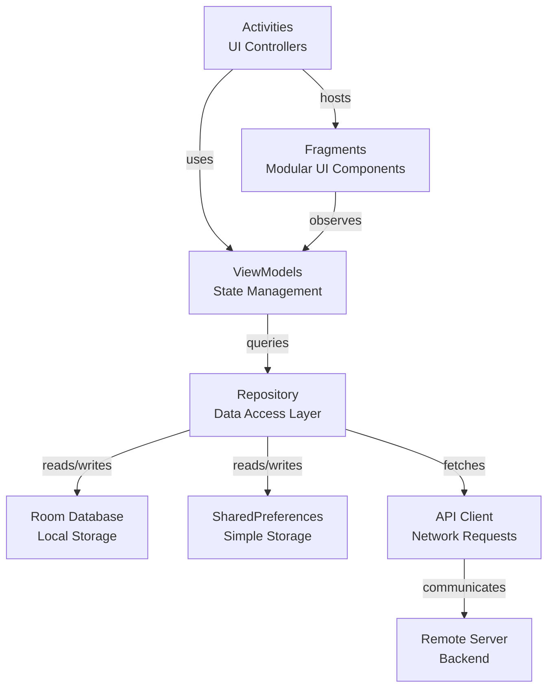

# Mobile Programming Projects

A collection of mobile application development projects created during mobile programming coursework, built with Kotlin and Android.

## About

This repository contains various mobile applications exploring Android development patterns, UI frameworks, and native features using Kotlin.

## Features

- Native Android development with Kotlin
- Modern Android architecture patterns
- Material Design UI components
- Activity and Fragment lifecycle management
- Data persistence and storage
- Intent-based navigation

## Tech Stack

- **Kotlin**: Primary language
- **Android SDK**: Native framework
- **Jetpack Libraries**: Architecture components
- **Material Design 3**: Modern UI design system
- **Room**: Local database
- **SharedPreferences**: Key-value storage
- **Gradle**: Build system

## Architecture (UML)



## Project Structure

```
main/
├── java/
│   └── com/example/mobile/
│       ├── ui/          # Activities & Fragments
│       ├── viewmodel/   # ViewModel classes
│       ├── data/        # Repository & database
│       └── network/     # API clients
├── res/
│   ├── layout/          # XML layouts
│   ├── drawable/        # Images & vectors
│   ├── values/          # Strings, colors, themes
│   └── menu/            # Menu resources
└── AndroidManifest.xml  # App manifest
```

## Getting Started

### Prerequisites

- Android Studio Koala or newer
- Android SDK 24+ (API level)
- Kotlin 1.9+

### Build & Run

1. Clone the repository
2. Open in Android Studio
3. Sync Gradle dependencies
4. Run on emulator or device via Android Studio

```bash
./gradlew build
./gradlew installDebug
```

## Development Notes

- Uses MVVM architecture pattern
- Follows Android Jetpack best practices
- Implements proper lifecycle handling
- Includes error handling and retry logic

## License

See LICENSE file for details
